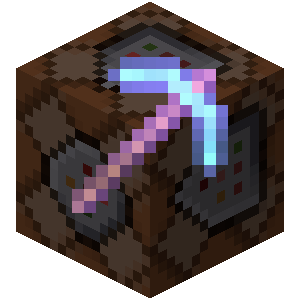

# Crafatar


<a href="https://crafatar.com">Crafatar</a> serves Minecraft avatars based on the skin for use in external applications.
Inspired by <a href="https://gravatar.com">Gravatar</a> (hence the name) and <a href="https://minotar.net">Minotar</a>.

**This is a complete TypeScript rewrite using Nx monorepo architecture.**

Image manipulation is done by [sharp](https://sharp.pixelplumbing.com/). 3D renders are created with [node-canvas](https://github.com/Automattic/node-canvas) / [cairo](http://cairographics.org/).

## Tech Stack

- **TypeScript**: Fully typed codebase with comprehensive documentation
- **Nx**: Modern monorepo build system
- **Node.js**: v18+ runtime
- **Redis**: Caching layer for skin metadata
- **Canvas**: Server-side canvas for 3D rendering
- **Sharp**: High-performance image processing
- **Docker**: Container-ready deployment

# Contributions welcome!

There are usually a few [open issues](https://github.com/crafatar/crafatar/issues).  
We welcome any opinions or advice in discussions as well as pull requests.  
Issues tagged with [](https://github.com/crafatar/crafatar/labels/help%20wanted) show where we could especially need your help!

# Examples

| | | | |
| :---: | :---: | :---: | :---: |
|  |  |  |  |  |
|  |  |  |  |  |
|  |  |  |  |  |
|  |  |  |  |  |

## Usage / Documentation

Please [visit the website](https://crafatar.com) for details.

## Project Structure

```
crafatar/
├── apps/
│   └── crafatar-api/          # Main API application
│       ├── src/
│       │   ├── config.ts      # Configuration management
│       │   ├── main.ts        # Application entry point
│       │   ├── lib/           # Core library modules
│       │   │   ├── cache.ts       # Redis caching
│       │   │   ├── helpers.ts     # Image retrieval helpers
│       │   │   ├── logging.ts     # Logging utilities
│       │   │   ├── networking.ts  # HTTP requests to Mojang
│       │   │   ├── renders.ts     # 3D skin rendering
│       │   │   ├── response.ts    # HTTP response handling
│       │   │   ├── server.ts      # HTTP server
│       │   │   └── skins.ts       # Skin image processing
│       │   ├── routes/        # API route handlers
│       │   │   ├── index.ts       # Documentation page
│       │   │   ├── avatars.ts     # Avatar endpoint
│       │   │   ├── skins.ts       # Skin endpoint
│       │   │   ├── renders.ts     # 3D render endpoint
│       │   │   └── capes.ts       # Cape endpoint
│       │   ├── views/         # EJS templates
│       │   └── public/        # Static assets
│       └── project.json       # Nx project configuration
├── docker-compose.yml         # Docker deployment configuration
├── Dockerfile                 # Container build configuration
├── nx.json                    # Nx workspace configuration
├── tsconfig.base.json         # TypeScript base configuration
└── package.json               # Dependencies and scripts
```

## Contact

* You can [follow](https://twitter.com/crafatar) us on twitter
* Open an [issue](https://github.com/crafatar/crafatar/issues/) on GitHub

# Installation

## Docker (Recommended)

```bash
# Build and start with Docker Compose
docker-compose up -d

# View logs
docker-compose logs -f crafatar-api

# Stop
docker-compose down
```

Or manually with Docker:

```sh
docker network create crafatar
docker run --net crafatar -d --name redis redis
docker run --net crafatar -v crafatar-images:/app/images -e REDIS_URL=redis://redis -p 3000:3000 crafatar/crafatar
```

## Manual

- Install [Node.js](https://nodejs.org/) 18+ (LTS recommended)
- Install `redis-server`
- Install canvas dependencies:
  - **Ubuntu/Debian**: `apt-get install build-essential libcairo2-dev libpango1.0-dev libjpeg-dev libgif-dev`
  - **macOS**: `brew install pkg-config cairo pango libpng jpeg giflib`
- Run `npm install`
- Run `npm run build`
- Run `npm start`

Crafatar is now available at http://0.0.0.0:3000.

## Development

```bash
# Install dependencies
npm install

# Build the project
npm run build

# Start the server
npm start

# Development mode (if available)
npm run dev
```

## Configuration / Environment variables

See the `apps/crafatar-api/src/config.ts` file for all available options.

### Server Settings

| Variable | Description | Default |
|----------|-------------|---------|
| `PORT` | HTTP server port | `3000` |
| `BIND` | IP address to bind | `0.0.0.0` |
| `DEBUG` | Enable debug mode | `false` |
| `LOG_TIME` | Include timestamps in logs | `false` |

### Redis

| Variable | Description | Default |
|----------|-------------|---------|
| `REDIS_URL` | Redis connection URL | `redis://localhost:6379` |

### Cache Settings

| Variable | Description | Default |
|----------|-------------|---------|
| `CACHE_LOCAL` | Seconds until skin check | `1200` (20 min) |
| `CACHE_BROWSER` | Browser cache max-age | `3600` (1 hour) |
| `EPHEMERAL_STORAGE` | Flush Redis on start | `false` |
| `CLOUDFLARE` | Using Cloudflare proxy | `false` |

### Image Settings

| Variable | Description | Default |
|----------|-------------|---------|
| `AVATAR_MIN` | Minimum avatar size | `1` |
| `AVATAR_MAX` | Maximum avatar size | `512` |
| `AVATAR_DEFAULT` | Default avatar size | `160` |
| `RENDER_MIN` | Minimum render scale | `1` |
| `RENDER_MAX` | Maximum render scale | `10` |
| `RENDER_DEFAULT` | Default render scale | `6` |

# Operational notes

## inodes

Crafatar stores a lot of images on disk. For avatars, these are 8×8 px PNG images with an average file size of \~90 bytes. This can lead to issues on file systems such as ext4, which (by default) has a bytes-per-inode ratio of 16Kb. With thousands of files with an average file size below this ratio, you will run out of available inodes before running out of disk space. (Note that this will still be reported as `ENOSPC: no space left on device`).

Consider using a different file system, changing the inode ratio, or deleting files before the inode limit is reached.

## disk space and memory usage

Eventually you will run out of disk space and/or redis will be out of memory. Make sure to delete image files and/or flush redis before this happens.

# Tests
```sh
npm test
```

If you want to debug failing tests:
```sh
# show logs during tests
env VERBOSE_TEST=true npm test
```

It can be helpful to monitor redis commands to debug caching errors:
```sh
redis-cli monitor
```

# License

MIT